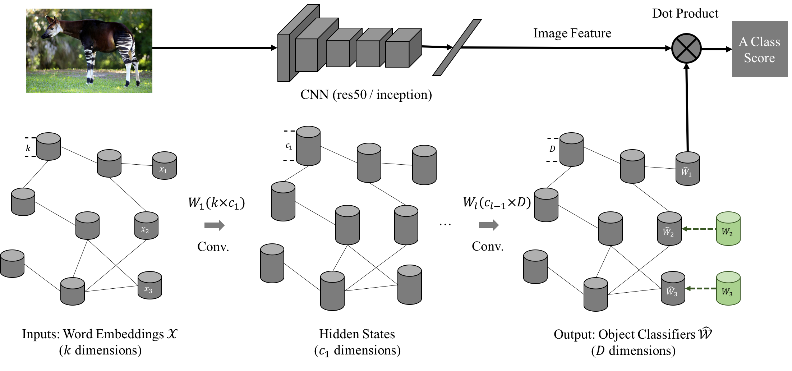

# Zero-shot GCN

This code is a re-implementation of the zero-shot classification in ImageNet in the paper [Zero-shot Recognition via Semantic Embeddings and Knowledge Graphs](https://arxiv.org/abs/1803.08035). The code is developed based on the [TensorFlow framework](https://www.tensorflow.org/) and the Graph Convolutional Network [repo](https://github.com/tkipf/gcn/tree/master/gcn).



The pipeline is as the figure above depicts. It consists of two network: CNN and the Graph Convolutional Networ (GCN) module. Our GCN model takes word embeddings for each object node as inputs and outputs the visual classifier for each object node. We take CNN as off-the-shelf network (ImageNet-1k pre-trained specifically) to extract image feature and provide its final FC classifiers as ground truths for the GCN outputs during training. After training with the visual classifiers of 1000 seen classes, we can generate the classifiers of all unseen classes. These classifiers can be directly on the extracted image features.

## Citation
If you find this work helpful, please consider citing:
```
@article{wang2018zero,
  title={Zero-shot Recognition via Semantic Embeddings and Knowledge Graphs},
  author={Wang, Xiaolong and Ye, Yufei and Gupta, Abhinav},
  journal={arXiv preprint arXiv:1803.08035},
  year={2018}
}
```

## Installation

```bash
git clone git@github.com:JudyYe/zero-shot-gcn.git
cd zero-shot-gcn/src
```
Let us call `zero-shot-gcn/src` as `$ROOT_FOLDER`

## Dataset Preparation
Please read [`DATASET.md`](DATASET.md) for downloading images and extracting image features.

## Testing
Although it takes 2 more steps to train GCN, at this point, we are ready to perform zero-shot classification with the [model](https://www.dropbox.com/sh/q9mid4wjj5vy0si/AADg8_NobfxkDot3VM7tE8Fua?dl=0) we provide.
```Shell
python test_imagenet.py --model $MODEL_PATH
```
The above line defaults to `res50` + `2-hops` combination and test under two settings: unseen classes with or without seen classes. (see the paper for further explaination.)

We also provide other configurations. Please refer to the code for details.

## Train your own GCN model
### Get data ready for GCN training
1. Extract semantic embedding
- You can download the embedding from [here](https://www.dropbox.com/sh/9pklcwm7rkhd9qa/AACDMMKHIMXNW5cmInFFrCDCa?dl=0) and link to to `../data/word_embedding_model/`
- We also provide the script `tools/obtain_word_embedding.py` to obtain 3 version of semantic embeddings.
    + **Note**:
        *  GoogleNews and Fasttext embedding may require some other packages.
        * You need to download the pretrained word embedding dictionary. The link is written in the beginning of the script. Please manually download what you need since some model in the google drive cannot wget.
2.  Convert to GCN data. The script converts semantic embedding to input $X$; prepare class relation graph; and convert classifier of pretrained CNN model to output $W$.
The output will be saved to ../data/$wv_$fc/
```Shell
python convert_to_gcn_data.py --fc res50 --wv glove
```
### Finally, start training!
```Shell
python gcn/train_gcn.py --gpu $GPU_ID 	--dataset ../data/glove_res50/ --save_path $SAVE_PATH
```

### Misc
`preprocess.sh` demonstrates how to get list in `data/list/`.
